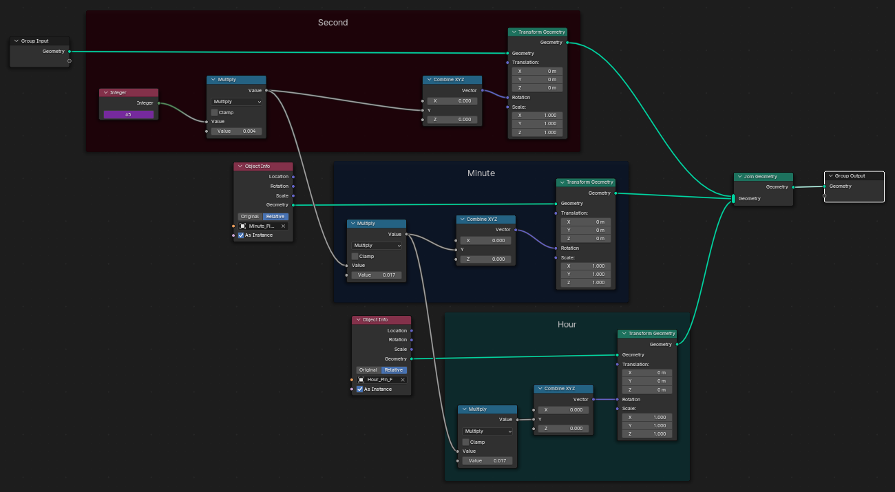
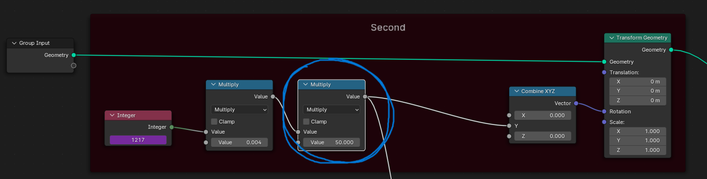
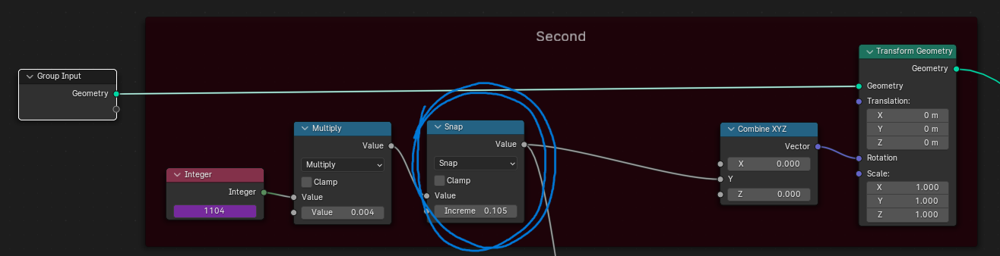

# Clock

## Second, Minute and Hour Pin
### Second
* We have to select the fps and timeframe for our animation. Here we will select the 24 fps and 1 minute animation.
* So, we got 24x60 = 1440 frames in total for the animation.
* A second indicator pin performs 360 degree rotation in 1 min. So, we have to find out how much it should rotate in each frame. 
* For the calculation, we will take radian values instead of degree.
* So, 360 degree = 6.28318531 radians, for each frame it should rotate (6.28318531/1440) radians.
* In the image, you can see that, we multiply the frame value with the per frame rotation and get the required rotation.
### Minute
* For minute pin, it will move 60 times slower than the second pin. So, we can easily multiply 1/60 with the rotation value for each frame.
* If we want we can directly calculate the rotation value. For each second, minute pin rotates 6 degree.
* Performing all the calculations, we get 7.2722222222222222222222222222222e-5 as the rotation value per second for each frame. We can directly multiply frame value with this one for minute pin rotation.
### Hour
* For hour pin, it will move 60 times slower than the minute pin. So, we can easily multiply 1/60 with the rotation value for each frame.
* We may use direct value 1.2120347222222222222222222222222e-6 as the rotation value.

## Second, Minute and Hour Pin
* Things get slower when we go accurately. But if we want the animation to be faster, we can have a value and multiply it with rotation value to make it n times faster. For example we have given 500 here. It will make all the pins animation faster. 

## Snap Effect
* In some clock, the second pin always doesn't rotate simultaneously. It pauses and then move. To make this effect we need to find out the threshold (6.28318531/1440). This value we need to put in and change the node to Snap. Then the second pin will rotate as soon as it reaches the threshold.

#### The original tutorial credit goes to [CrossMind Studio](https://www.youtube.com/@CrossMindStudio) and it can be found [here](https://youtu.be/_PWaBW5uJfE?si=JDK74n_w46u8Snhx).
