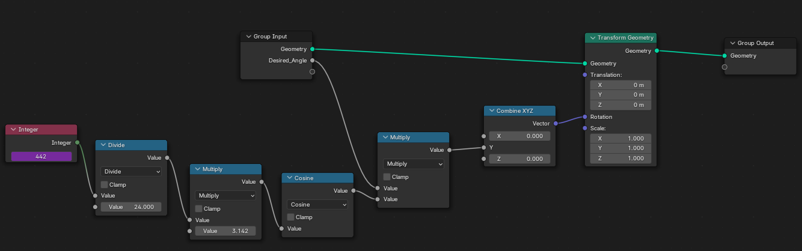

# Pendulum
    θ(t) = A cos( πt )
    A = Angle in radians
    t = second

    θ(f) = A cos( πf /24 )
    f = frame

# Faster Pendulum

    θ(f) = A cos( nπf / 24 )
    n = How much faster for example 10 times faster

