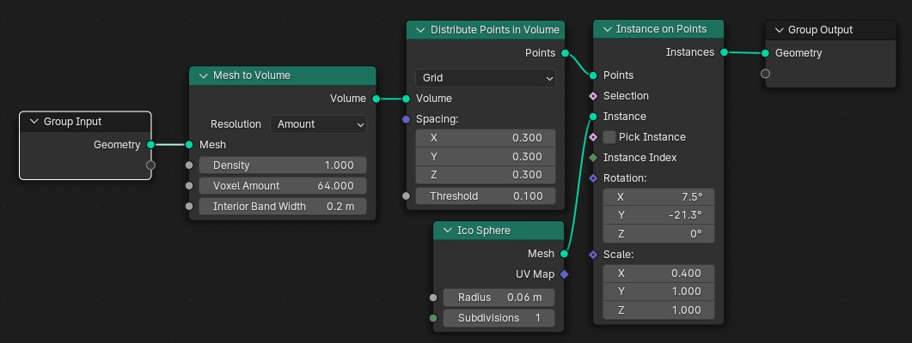

# Instances
Instances only duplicate the geometry data but not the mesh data. It takes one time the mesh data of our object, then only changes the position of our mesh data.

## Instance on Points
It palces the instance on points. Suppose, we want to place a mesh instead of the distributed points. To Instance we can connect our desired mesh. We can perform the Rotation and Scale of the instances. We can also use Random node for different scaling and rotation.

## Instances to Points
We can convert the instances back to points. It is exactly same as the 'Distribute Points on Faces'.

## Realize Instances

## Rotate Instances

## Scale Instances

## Translate Instances

## Instance Rotation

## Instance Scale