# Mesh

## Operations

### Dual Mesh
It takes every face and put a vertex in the middle position. Then create a new mesh connecting all of those vertices. We can take an icosphere and create a cool shield effect from it.
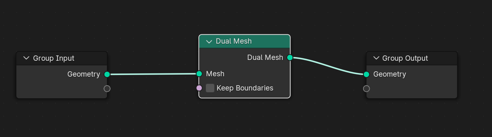

### Edge Paths to Curves
It converts the edge paths to curves. To make it work properly, we need a couple of more nodes.
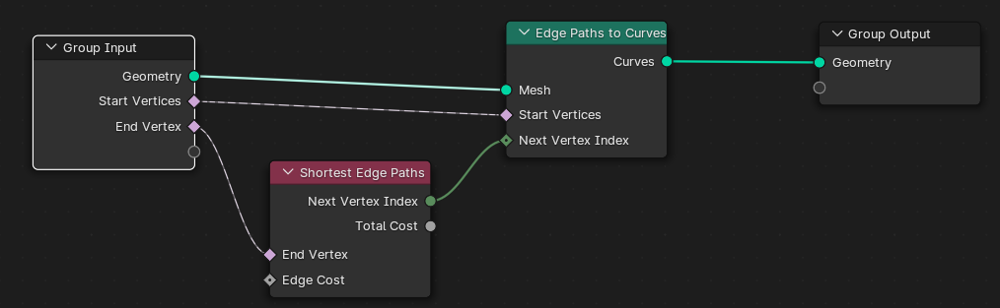

### Edge Paths to Selection
We can convert the edge paths to a particular selection and use it for different purposes.
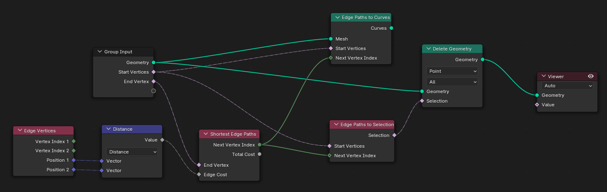

### Extrude Mesh
This takes all of our vertices and extrudes them. It's the same as we have in the edit mode. We can have a particular vertex group as selection and pass it here. We can also define random value for offset scale. We can define only edges or even vertices.  
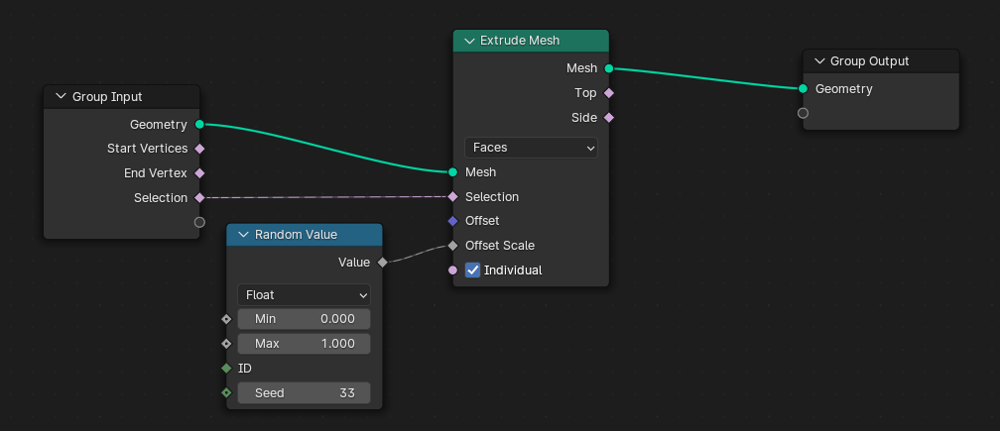
We can also define to extrude from side or top from the attributes in the node.
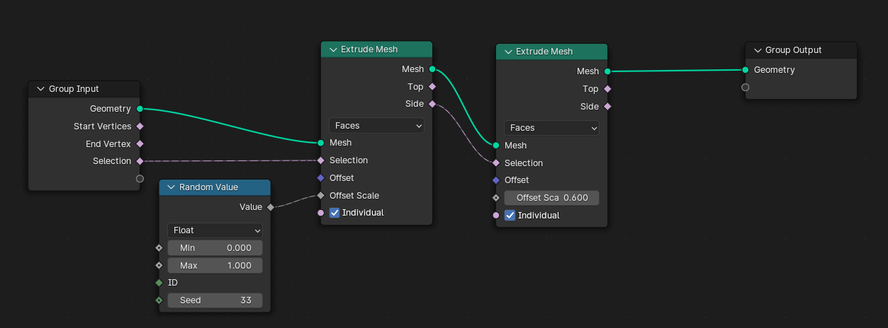

### Flip Faces
A face has 2 sides. We can view this by enabling the face orientation. This node simply changes the face orientation. We may need this in any corner cases. We can also define a mask through the selection.
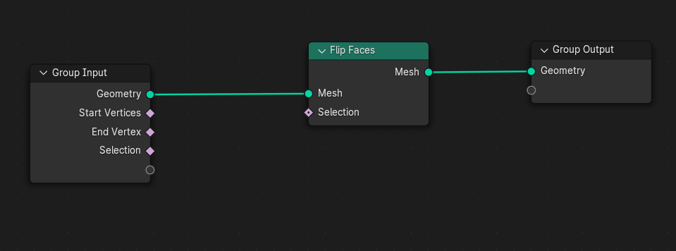

### Mesh Boolean
We can use this to cut hole in with another object. We can also perform other tasks such as intersection and joining. Set the intersecting object position relative.
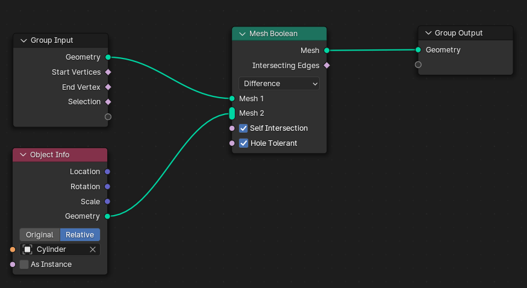

### Mesh to Curve
It takes every edge and converts them into curves. Then we can create cool animation using this based on curves. We can use trim curve to trim curves changing the factor values.
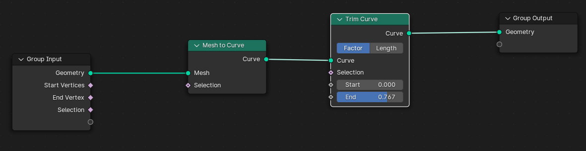
Then we can again convert the curve to mesh and use it according to need.
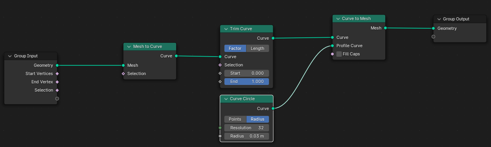

### Mesh to Points
It takes a face and place a point in the middle of each face. It also takes vertices, edges and corners. Then place the points accordingly. We can change the radius of the points.
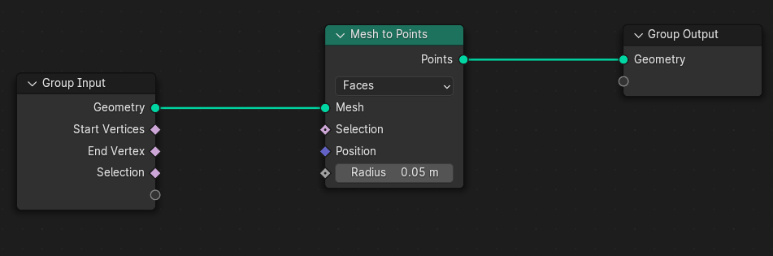

### Mesh to Volume
It takes the original mesh and converts it into volume. We can also remesh it using 'Volume to Mesh'.
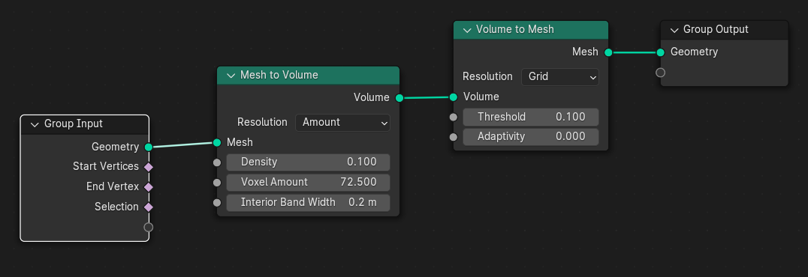

## Read

### Shortest Edge Paths
It calculates the shortest path from every vertices through the edges of our mesh to our set end vertices. We have to define the end vertex. We need to assign vertex groups as the attributes to work with this. When we provide the start and end vertices, it will provide us with the shortest path edge. This one by default takes all the edge cost as 1. To change it we can use Random Value or Noise Texture for varying costs for different edges. 
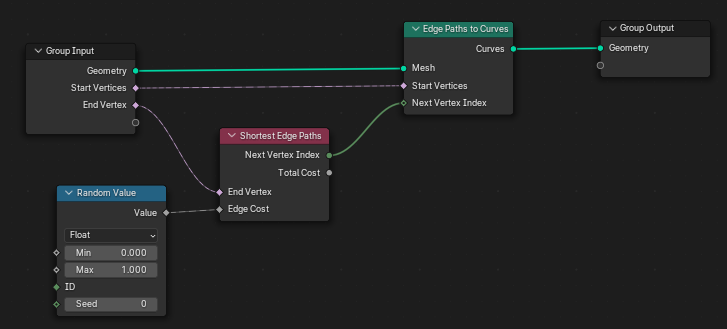
Normally we use Edge length for edge cost, because the longer the edge, the more cost it should have. For that, we will use Edge Vertices and Vector Math node with Distance for the calculation. In this way, the shorter edges have more weight than the shorter ones. 
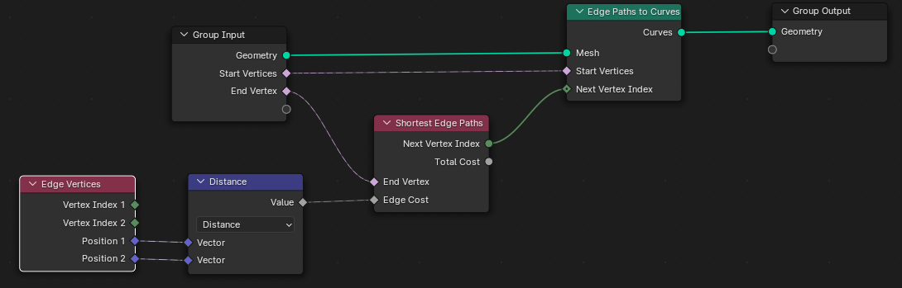
