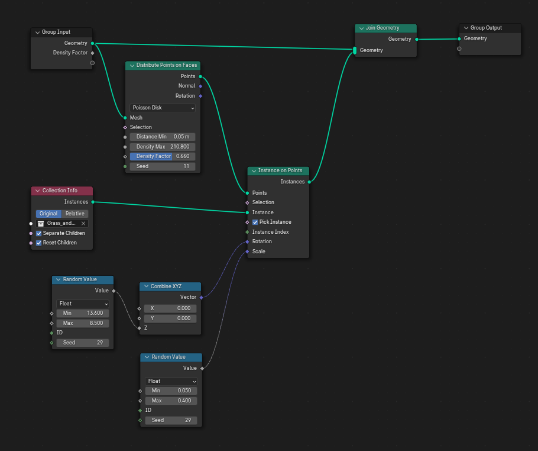
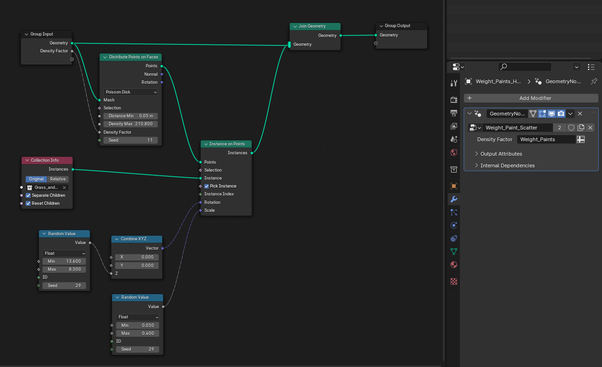

# Distribution of one object into placeholder mesh 
* Select the object holder mesh where you want to scatter the object, then click on **New** in the **Geometry Nodes Editor** from the nodes browser in the top panel.
* **Instance On Points:-**
	We will place this node between the **Group Input** and **Group Output**.
	When we do that, the holder mesh will disappear. We need to add the original
	geometry to the output. When we are joining through the point node, it's getting rid of that. 
* **Join Geometry:-** 
	We need to place this in between of **Instance on Points** and **Group Output**.
	We also need to give input from **Group Input**. It will connect the holder mesh 
	back to the output. 
* **Object Info:-** 
	This is different from shader's object info node. This basically tells what
	object we need to use. We need to select the scattering object in this node.
	The add the **Geometry** to **Instance on Points Instance**'s connector. It tells the
	node to instance the given object. The object may look to big if not scaled.
	So, change the scale values in the **Instance on Points** node. It will instance the 
	object in the vertices. The object gets placed on the vertices. If we subdivide,
	then there will be more points and the objects will be placed there. But we want 
	the objects to be placed randomly on the surface. 
* **Distribute Points on Faces:-** 
	We need a new node for random distribution. Place this node in between of **Group Input**
	and **Instance on Points** node. The objects will be randomly all around.
	* **Random:** 
		* **Density-** If we increase the value, then there will be more objects there.
		* **Seed-** The changing seed value defines different distributions.
		
        But there will be overlapping between the objects and totally random.
	* **Poisson Disk:** 
		Here we can ensure spaces between the objects to get rid of overlapping. We
		can use the settings to give space between all the objects. 
		* **Distance Min-** Turning up this value will increase the gap between the objects. So, use a smaller value for example, starting from 0.001 to 0.1. 
		* **Density Max-** Increase the value to add more and more objects to the holder. 
		* **Density Factor-** This value will define changes in the density of the objects.
		* **Seed-** Change this value for randomness.
* **Random Value:-**
	We need to give the objects random rotation and scale to make things look more natural.
	In the case of scaling, add this node's output to the **Instance On Point's Scale**.
	* **Min-** We can define what should be the smaller value for the transformation we want. 
	* **Max-** We can define the bigger value for the transformation we want. 
	* **Seed-** For randomness.
	We can also change to **Vector** from **Float** for more clarifying values and use that directly
	instead of **Combine XYZ**.
* **Combine XYZ:-** 
	In the cases of rotation, sometimes we only want in particular axis. In that case,
	we can use the **Random Value**'s Output to **Combine XYZ**'s required axis input and then
	add the output to **Instance on Point's Rotation** value.
* Tutorial can be found [here](https://youtu.be/lrhlOBWXd7Y?si=mRahioJX0jkE_Ydu).
	

		
# Distribution of mutiple objects/collection into placeholder mesh
More or less everything will be the same just with a few changes. 
* **Collection Info:-** 
    * Instead of Object Info we will be using this node. We need to keep all the objects into one collection and select the collection in the node. 
	* In this case, it considers the entire collection as the object. It places the objects according to that. 
	* **Seperate Children-** We want to place the objects individually, so we need to check in this button. Also, we need to enable **Pick Instance** from the **Instance On Points**. 
	* **Reset Children-** Lot of objects may go out of the holder. It's because it consider the location from origin of the world. That's why we need to enable the **Reset Children**.
	* Tutorial can be found [here](https://youtu.be/lrhlOBWXd7Y?si=mRahioJX0jkE_Ydu).

# Distribution of objects using Weight paint Geometry Nodes
* It's the same for scattering object and collections. 
* Take a wire from **Group Input**'s second connection and connect it to **Distribute Points** on **Faces's Density Factor** input.
* In the viewport switch to **Weight Paint**. Perform a paint on the holder object.
* Now go to **Modifier** of the object and you will see a geometry node modifier is added there.
* In the selected node, click on **Density Factor's Input Attribute Toggle** button and select **Point->Group Float**.
* Before that, we can go to **Object Data Properties**, in the **Vertex Group** rename the vertices group. and select it from the **Attribute Toggle**.
* In the weight paints, the more red means more of the object and dark blue means no object and in between yellow, green means dense to less. 
* If we want to remove way instead of addition of ways, then in the **Weight Paint** mode, we can switch the brush from **Add** to **Subtract** from the upper panel tab.
* Tutorial can be found [here](https://youtu.be/6LMuT2hN2yw?si=gBlyjEYMD-YZwk9d).

	
	
	
	
	
	
	
	
	
	
	
	

