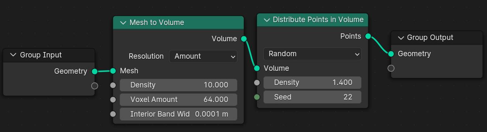
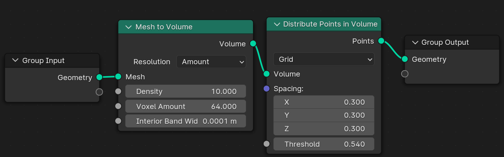
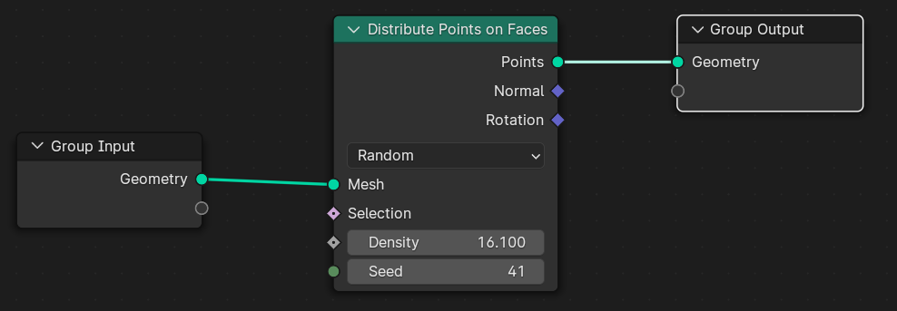
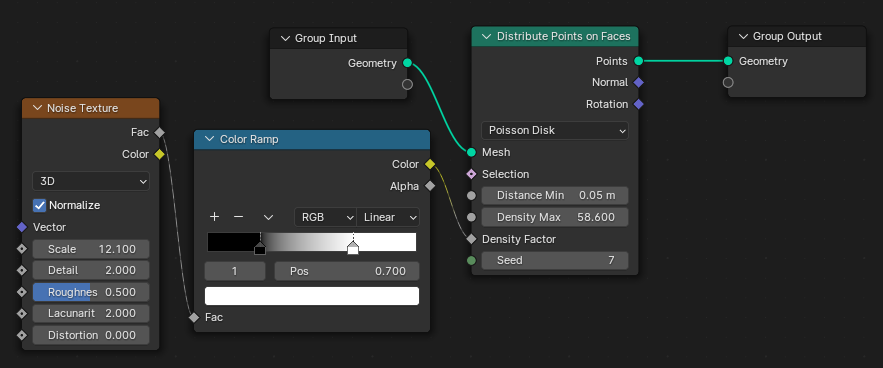
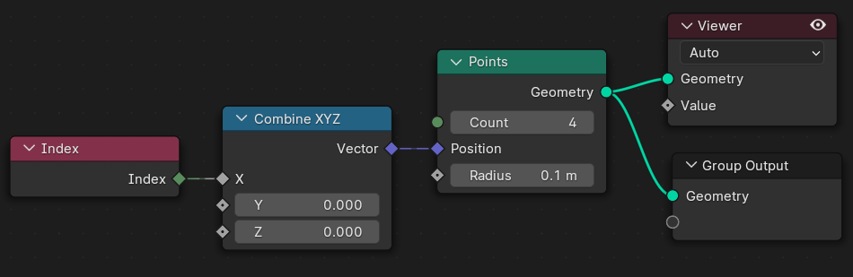
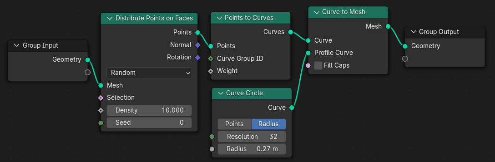
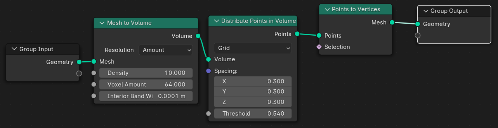
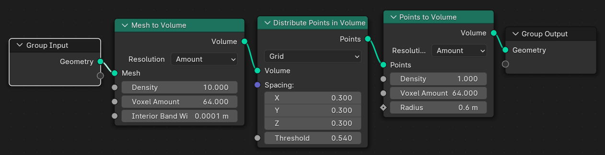
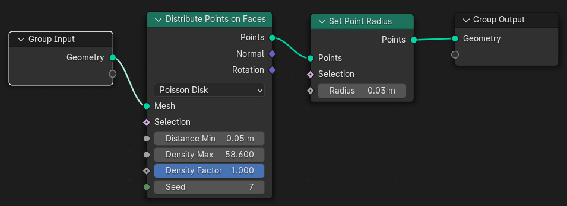

# Point

## Distribute Points in Volume
It distributes the points into 3d space. For that, we need to convert the mesh to volume using 'Mesh to Volume' node.
In Random mode, we distribute points randomly and control the density using Density and Seed value.

In Grid mode, we place the points in grid mode. We can change the spacing between the points by changing X, Y and Z value. To control the density we need to use threshold.

## Distribute Points on Faces
This node places a bunch of points on the surface of our object. On every face, it will disribute points. Points are just coordinates without further mesh data. In cycles, they can be rendered as spheres.
In Random mode, it places the points randomly. We can change the seed value and density to control the number of points we want.

In Poisson Disk mode, we can choose a minimum distance using Distance Min attribute. It defines the minimum distance between each point. Then we can control the density using Density Max and Density Factor attribute. For better control we can use a 'Noise Texture' and 'Color Ramp' through the density factor. Also we can randomize using the seed value.

We can use the Selection to select or weight paint the area where we want the points to be.

## Points
This node adds point in the viewport. We can see this using 'Viewer' node. We can change the number of points by changing the Count. We can change the Radius. If we go to Spreadsheet window and want to view what our 'Viewer' node sees, we can find the points there. Initially all the points will be at same position. To view points, we need to change

## Points to Curve
It converts the distributed points to curve. We can convert the curve to mesh using profile curve and use it according to our need.

## Points to Vertices
This simply converts our points to vertices. By applying it, we can create a new mesh if we want.

## Points to Volume
It converts every points to volume. Each point gets a field of volume around it. We can control the Density, Radius and the Voxel Amount to change thing according to need.

## Set Point Radius
This node sets the radius of the distributed points.

